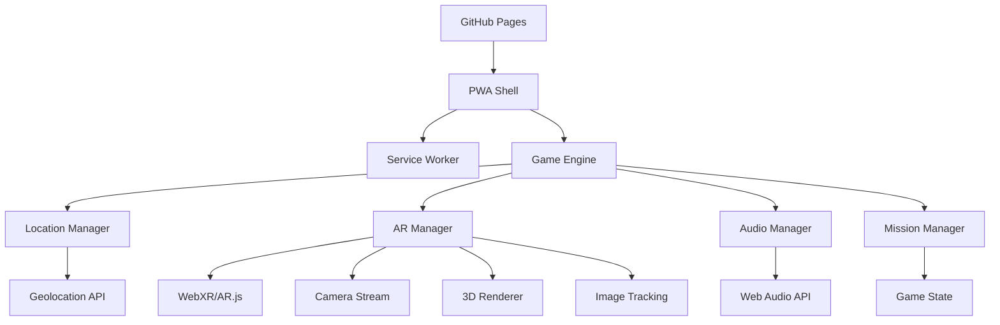

# Documento de Design

## Visão Geral

O jogo "Stranger Things AR" é uma Progressive Web App (PWA) que combina realidade aumentada, geolocalização e elementos narrativos para criar uma experiência imersiva baseada na série. O jogo utiliza tecnologias web modernas para funcionar diretamente no navegador móvel, sem necessidade de instalação de aplicativo.

## Arquitetura

### Arquitetura Geral do Sistema



### Stack Tecnológico

**Frontend:**
- HTML5, CSS3, JavaScript ES6+
- A-Frame + AR.js para realidade aumentada
- Three.js para renderização 3D
- Service Worker para funcionamento offline
- Web Audio API para áudio espacial

**Hospedagem:**
- GitHub Pages (estático)
- PWA com manifest.json
- Cache estratégico para assets

**APIs do Dispositivo:**
- Geolocation API
- Camera API (getUserMedia)
- Vibration API
- DeviceOrientationEvent

## Componentes e Interfaces

### 1. Game Engine (Core)

```javascript
class StrangerThingsGame {
  constructor() {
    this.state = new GameState();
    this.locationManager = new LocationManager();
    this.arManager = new ARManager();
    this.audioManager = new AudioManager();
    this.missionManager = new MissionManager();
  }
  
  async init() {
    await this.loadAssets();
    await this.requestPermissions();
    this.setupEventListeners();
  }
  
  async loadAssets() {
    // Carrega todos os assets para cache offline
  }
}
```

### 2. Location Manager

```javascript
class LocationManager {
  constructor() {
    this.currentPosition = null;
    this.targetPosition = null;
    this.watchId = null;
  }
  
  async getCurrentPosition() {
    // Implementa geolocalização com alta precisão
  }
  
  calculateDirection(from, to) {
    // Calcula bearing entre duas coordenadas
  }
  
  getDistance(from, to) {
    // Calcula distância usando fórmula de Haversine
  }
  
  isNearTarget(threshold = 20) {
    // Verifica se está dentro do raio do objetivo
  }
}
```

### 3. AR Manager

```javascript
class ARManager {
  constructor() {
    this.scene = null;
    this.camera = null;
    this.renderer = null;
    this.arToolkitSource = null;
    this.arToolkitContext = null;
  }
  
  async initAR() {
    // Inicializa A-Frame + AR.js
  }
  
  addModel(modelPath, position) {
    // Adiciona modelo 3D à cena AR
  }
  
  setupImageTracking(imagePath) {
    // Configura rastreamento de imagem
  }
  
  applyUpsideDownFilter() {
    // Aplica filtro esverdeado e partículas
  }
}
```

### 4. Audio Manager

```javascript
class AudioManager {
  constructor() {
    this.audioContext = null;
    this.audioCache = new Map();
  }
  
  async preloadAudio(audioFiles) {
    // Pré-carrega todos os arquivos de áudio
  }
  
  playAudio(audioPath, options = {}) {
    // Reproduz áudio com controles de volume/loop
  }
  
  stopAll() {
    // Para todos os áudios em reprodução
  }
}
```

### 5. Mission Manager

```javascript
class MissionManager {
  constructor() {
    this.missions = [];
    this.currentMission = 0;
    this.inventory = [];
  }
  
  loadMissions() {
    // Carrega configuração de todas as missões
  }
  
  startMission(missionId) {
    // Inicia uma missão específica
  }
  
  completeMission() {
    // Marca missão como completa e avança
  }
  
  addToInventory(item) {
    // Adiciona item ao inventário do jogador
  }
}
```

## Modelos de Dados

### Game State

```javascript
const gameState = {
  currentMission: 0,
  playerPosition: {
    lat: null,
    lng: null,
    accuracy: null
  },
  inventory: [],
  upsideDownMode: false,
  permissions: {
    camera: false,
    location: false,
    vibration: false
  },
  assets: {
    loaded: false,
    progress: 0
  }
};
```

### Mission Configuration

```javascript
const missions = [
  {
    id: 1,
    name: "Floresta das Trevas",
    type: "ar_model",
    location: {
      lat: -27.63054776462635,
      lng: -48.681133649550205
    },
    radius: 20,
    arContent: {
      type: "model",
      path: "assets/models/bicicleta-will.glb",
      scale: [1, 1, 1],
      position: [0, 0, -2]
    },
    audio: {
      completion: "sounds/call/dustin-missao-1-completa.wav"
    }
  },
  // ... outras missões
];
```

## Implementação de Funcionalidades Específicas

### 1. Sistema de Navegação com Seta CSS

```css
.navigation-arrow {
  position: fixed;
  top: 50%;
  left: 50%;
  width: 60px;
  height: 60px;
  transform: translate(-50%, -50%);
  z-index: 1000;
}

.arrow-svg {
  width: 100%;
  height: 100%;
  fill: #ff6b6b;
  filter: drop-shadow(0 0 10px rgba(255, 107, 107, 0.8));
  transition: transform 0.3s ease;
}
```

```javascript
function updateArrowDirection(bearing) {
  const arrow = document.querySelector('.arrow-svg');
  arrow.style.transform = `rotate(${bearing}deg)`;
}
```

### 2. Sistema de Vibração

```javascript
function vibrateDevice(pattern = [200, 100, 200]) {
  if ('vibrate' in navigator) {
    navigator.vibrate(pattern);
  }
}
```

### 3. Filtro Mundo Invertido

```css
.upside-down-filter {
  filter: hue-rotate(90deg) saturate(1.5) brightness(0.8);
  background: radial-gradient(circle, transparent 0%, rgba(0, 100, 0, 0.1) 100%);
}

.particles-overlay {
  position: fixed;
  top: 0;
  left: 0;
  width: 100%;
  height: 100%;
  pointer-events: none;
  z-index: 500;
}
```

### 4. Sistema de Cache Offline

```javascript
// Service Worker
const CACHE_NAME = 'stranger-things-ar-v1';
const urlsToCache = [
  '/',
  '/index.html',
  '/css/style.css',
  '/js/game.js',
  '/fonts/stranger-things.ttf',
  // Todos os assets de áudio, imagem e modelos 3D
];

self.addEventListener('install', (event) => {
  event.waitUntil(
    caches.open(CACHE_NAME)
      .then((cache) => cache.addAll(urlsToCache))
  );
});
```

## Tratamento de Erros

### 1. Permissões Negadas

```javascript
class PermissionHandler {
  async requestCameraPermission() {
    try {
      const stream = await navigator.mediaDevices.getUserMedia({ video: true });
      stream.getTracks().forEach(track => track.stop());
      return true;
    } catch (error) {
      this.showPermissionError('camera');
      return false;
    }
  }
  
  showPermissionError(type) {
    // Exibe modal com instruções para habilitar permissão
  }
}
```

### 2. Falhas de Geolocalização

```javascript
function handleLocationError(error) {
  switch(error.code) {
    case error.PERMISSION_DENIED:
      showError("Permissão de localização negada");
      break;
    case error.POSITION_UNAVAILABLE:
      showError("Localização indisponível");
      break;
    case error.TIMEOUT:
      showError("Timeout na obtenção da localização");
      break;
  }
}
```

### 3. Falhas de AR

```javascript
function handleARError(error) {
  console.error('AR Error:', error);
  // Fallback para modo sem AR
  showFallbackMode();
}
```

## Estratégia de Testes

### 1. Testes Unitários

- Testes para cálculos de geolocalização
- Testes para lógica de missões
- Testes para gerenciamento de estado

### 2. Testes de Integração

- Testes de fluxo completo de missões
- Testes de integração com APIs do dispositivo
- Testes de cache offline

### 3. Testes de Dispositivo

- Testes específicos no Samsung S20 FE
- Testes de performance AR
- Testes de precisão de geolocalização

### 4. Testes de Usabilidade

- Testes de interface em orientação retrato
- Testes de acessibilidade
- Testes de experiência do usuário

## Otimizações de Performance

### 1. Carregamento de Assets

```javascript
class AssetLoader {
  async loadWithProgress(assets) {
    const total = assets.length;
    let loaded = 0;
    
    for (const asset of assets) {
      await this.loadAsset(asset);
      loaded++;
      this.updateProgress(loaded / total);
    }
  }
  
  updateProgress(progress) {
    // Atualiza barra de progresso
  }
}
```

### 2. Otimização de Modelos 3D

- Modelos GLB otimizados para mobile
- LOD (Level of Detail) baseado na distância
- Compressão de texturas

### 3. Gerenciamento de Memória

```javascript
class MemoryManager {
  cleanupUnusedAssets() {
    // Remove assets não utilizados da memória
  }
  
  optimizeForMobile() {
    // Ajusta qualidade baseado na performance
  }
}
```

## Considerações de Segurança

### 1. Validação de Localização

```javascript
function validateLocation(lat, lng) {
  // Valida se as coordenadas estão dentro da área esperada
  const pedrabrancaBounds = {
    north: -27.620,
    south: -27.640,
    east: -48.670,
    west: -48.690
  };
  
  return lat >= pedrabrancaBounds.south && 
         lat <= pedrabrancaBounds.north &&
         lng >= pedrabrancaBounds.west && 
         lng <= pedrabrancaBounds.east;
}
```

### 2. Sanitização de Dados

- Validação de entrada do usuário
- Sanitização de URLs de assets
- Proteção contra XSS

### 3. Privacidade

- Dados de localização não são enviados para servidores
- Cache local apenas
- Permissões solicitadas apenas quando necessário